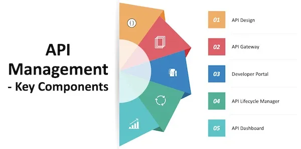

# HTTP
Hypertext Transfer Protocol -> is a communication protocal. It is used to send and receive webpages and files on the internet.

# API
- API stands for Application Programming Interface, API’s communicate through a set of rules/protocols that defines how computers, applications, or machines can talk to each other.
- It works over the internet via HTTP protocol which works on top of the TCP/IP protocol

# API Management
API management is the process of designing, publishing, documenting and analyzing APIs in a secure environment to ensure APIs are consumable and secure.
 



## Types Of API
- `Open APIs:` Also known as Public API, there are no restrictions to access these types of APIs because they are publicly available.
- `Partner APIs:` A developer needs specific rights or licenses to access this type of API because they are not available to the public.
- `Internal APIs:` Also known as Private APIs, only internal systems expose this type of API.

# API protocols or architectures
`REST` | `RPC` | `SOAP`

# Rest
    It's architectural style / convention that was created to guide the design and development of the architecture of communication

## REST API Design Best Practices
- Use JSON format
- Define content type `'Content-Type' : 'application/json'`
- Use Nouns Instead of Verbs in `Endpoints` ( already using GET, POST, PUT, PATCH, and DELETE in methods, so `donot add` it in URL)
- Use Status Codes in Error Handling 
``` 
    ( 100 - 199 ) Information
    ( 300 – 399 ) Redirects
    ( 400 – 499 ) Client-side errors
    ( 500 – 599 ) Server-side errors
```
- Use Nesting on Endpoints to Show Relationships ( `/users/teacher` )
- Use Filtering, Sorting, and Pagination to Retrieve the Data Requested (`/posts?tags=javascript&limit=20`)
- Use SSL for Security
- Be Clear with Versioning
- Accurate API Documentation
- Use hyphens (-) to improve the readability of URIs
- Use forward slashes (/) for hierarchy but not trailing forward slash (/)
- Use lowercase letters in URIs
- Never use CRUD function names in URIs


# Restful API
An api which fulfil all the constrains of rest api.
## HTTP v API


https://medium.com/@krunalchauhan_/article-worth-reading-on-what-is-an-api-what-is-a-rest-api-and-deep-diving-into-rest-api-fea074dacaed
