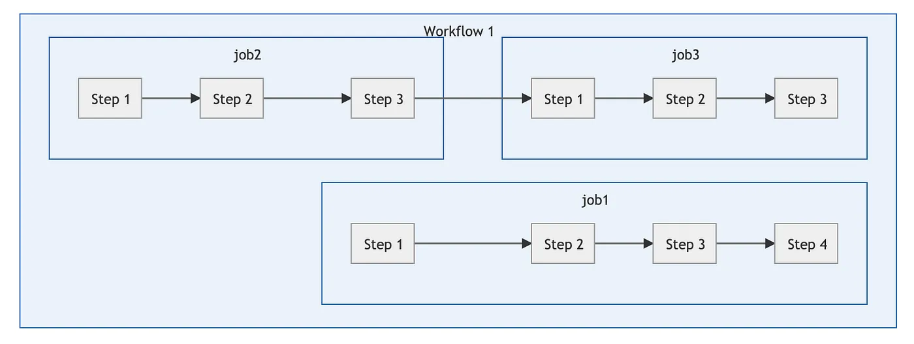

# Github Actions
- Automate software development workflow
- Testing
- Automatic releases

___
## Workflow
- Workflow is a collection of job definition that will be executed concurrently as well as sequentially, when it’s triggered by an event.

To add a workflow in repo **.github/workflows** folder, which will contain workflow files with **.yml** extension.
___

## Events
- An event is anything that can happen on a Github repository. This goes from pushing a code, creating a branch, opening a pull request, and even commenting on an issue.
 

## Jobs
- Jobs can be executed concurrently as well as sequentially
- A job is consists of several steps which will be executed sequentially
- A job is a series of tasks that gets executed in a workflow upon being triggered by an event. Each step is either a script or a Github action.

## Runners
- Runners are processes on a server that run the workflow when it’s triggered. Each runner is responsible for executing a given job.
Runners are hosted in the cloud but…

